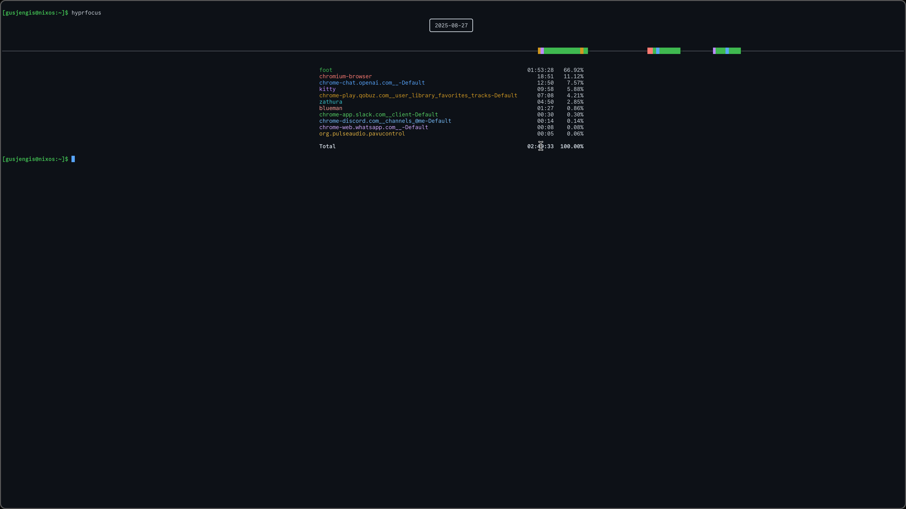

# hyprlog
This is an activity/focus logger for hyprland.

This is achieved by using the hyprlogd daemon to record all focus events in a log.  
The hyprlog CLI will use these logs to generate reports on your activity.

## Screenshots
Default


Multi-Line


Multi-Day


## Usage

Usage: hyprlog  
[ --help | -h ]  
[ --full | -f ]  
[ --multi | -m ]  
[ --days DAY_COUNT | -d DAY_COUNT ]  
[ --class CLASS_NAME | -c CLASS_NAME ]  
[ --idle | --resume]  

## Installation
Install the hyprlog CLI and hyprlog daemon with cargo.
'''bash
cargo install hyprlog
'''


Add the hyprlogd daemon to the AUTOSTART section of your hyprland config, otherwise no data will be collected and this is useless.


hyprland.conf
```conf
exec-once = hyprlogd
```


## Configuration
### Idle Events
Accurate focus data requires that hyprlog is informed of idle events. Below is an example of how to set that up using hypridle (STRONGLY RECOMMENDED).


hypridle.conf
```conf
listener {
    timeout = 180
    on-timeout = hyprlog --idle
    on-resume = hyprlog --resume
}
```
### Tmux
By default, tmux won't expose the current command as a title, anything done in a tmux session just shows up as "bash" in the terminal emulator(kitty) summary. This setting fixes that. 


tmux.conf
```conf
set -g set-titles on
set -g set-titles-string "#{pane_current_command}"
```
### Class Aliasing
Some programs have pretty ugly window classes. The hyprlog config file at ~/.config/hypr/hyprlog.conf supports class aliases.


hyprlog.conf
```conf
class_alias = "chromium-browser", "chromium"
class_alias = "plasticx", "plastic"
class_alias = "gcr-prompter", "keyring" 
class_alias = ".blueman-manager-wrapped", "blueman"
class_alias = "com.github.wwmm.easyeffects", "easyeffects"
class_alias = "org.gnome.Nautilus", "nautilus"
class_alias = "org.pwmt.zathura", "zathura"
class_alias = "com.network.manager", "nmgui"

# chromium webapps (--app argument)
class_alias = "chrome-chat.openai.com__-Default", "ChatGPT"
class_alias = "chrome-outlook.live.com__mail_0_-Default", "outlook"
class_alias = "chrome-discord.com__channels_@me-Default", "discord"
class_alias = "chrome-calendar.google.com__-Default", "calendar"
class_alias = "chrome-web.whatsapp.com__-Default", "whatsapp"
class_alias = "chrome-play.qobuz.com__user_library_favorites_tracks-Default", "qobuz"
class_alias = "chrome-app.slack.com__client-Default", "slack"
```
