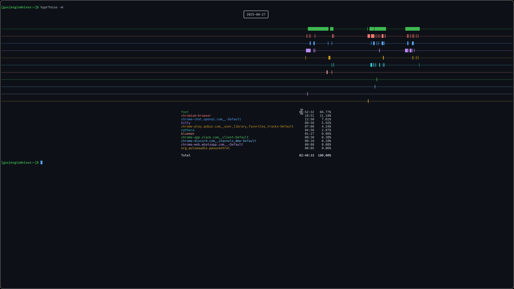
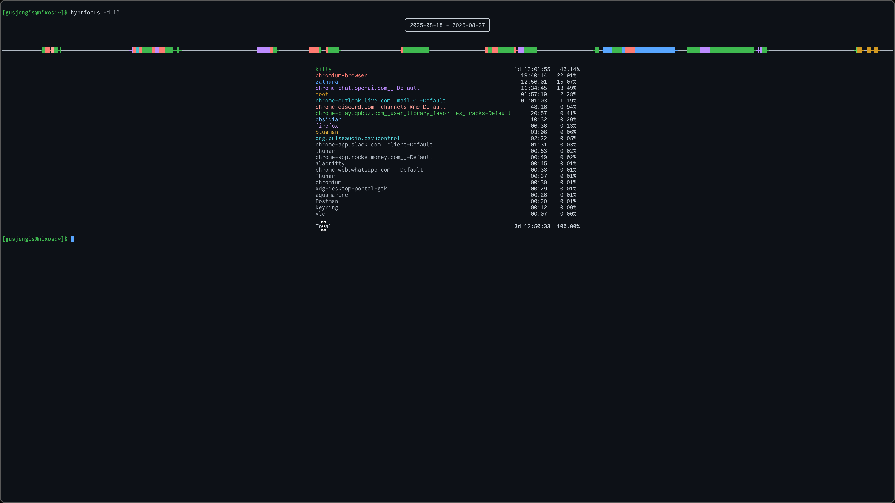

# hyprfocus
This is an activity/screen time tracker for hyprland.

This is achieved by using the hyprfocusd daemon to record all focus events in a log.  
The hyprfocus CLI will use these logs to generate reports on your activity.

## Screeshots




## Usage

Usage: hyprfocus  
[ --help | -h ]  
[ --full | -f ]  
[ --multi | -m ]  
[ --days DAY_COUNT | -d DAY_COUNT ]  
[ --class CLASS_NAME | -c CLASS_NAME ]  
[ --idle | --resume]  

## Configuration

hyprland.conf
```
exec-once = hyprfocusd
```
Add the hyprfocusd daemon to the AUTOSTART section of your hyprland config, otherwise no data will be collected and this is useless.

hypridle.conf
```
listener {
    timeout = 180
    on-timeout = hyprfocus --idle
    on-resume = hyprfocus --resume
}
```
Accurate focus data requires that hyprfocus is informed of idle events. Above is an example of how to set that up using hypridle
